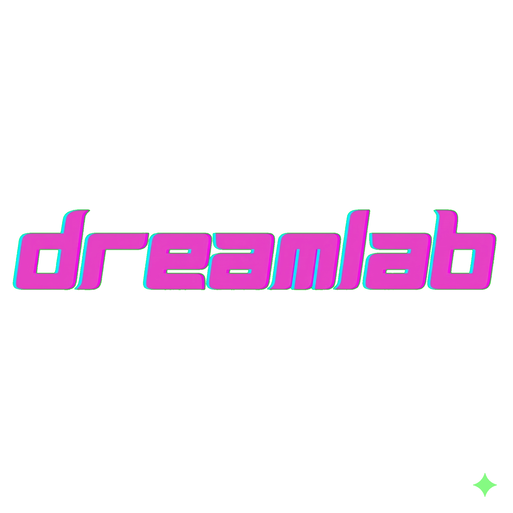

# Dreamlab Jarvis Filemaker

> Drop any file or paste text — get clean **Jarvis Ready Markdown** instantly.

A retro-styled, 100% client-side tool that converts files and text into clean `.md` files ready for AI ingest. **Your files never leave your browser. No servers, no APIs, no build step.**

---

## Supported Inputs

| Input Type | Formats |
|---|---|
| Documents | PDF, DOCX, DOC, RTF |
| Text | TXT, MD, RST, TEX, LOG |
| Web | HTML, HTM |
| Data | CSV, TSV, JSON, XML |
| Paste | Plain text, HTML |

---

## Features

- **Drag & drop** or click to upload files
- **Paste** plain text or raw HTML directly
- **Live Markdown preview** alongside raw output
- **Copy to clipboard** or **download as `.md`**
- Smart heading detection for plain text
- CSV / TSV → Markdown table conversion
- JSON arrays → Markdown tables
- Custom output filename before download
- Retro CRT neon UI with TV static background
- Works fully offline once loaded

---

## Deploy on GitHub Pages

1. Push this repo to GitHub
2. Go to **Settings → Pages**
3. Set source: **Deploy from a branch** → `main` → `/ (root)`
4. Click **Save** — live at `https://<username>.github.io/<repo-name>/`

No build step, no dependencies to install.

---

## Run Locally

Because CDN libraries are loaded over HTTPS, open via a local server rather than `file://`:

```bash
python -m http.server 8080
# then open http://localhost:8080
```

Libraries used (all loaded from CDN, no install needed):

- [PDF.js](https://mozilla.github.io/pdf.js/) — PDF text extraction
- [Mammoth.js](https://github.com/mwilliamson/mammoth.js) — DOCX → HTML
- [Turndown.js](https://github.com/mixmark-io/turndown) — HTML → Markdown
- [Press Start 2P + VT323](https://fonts.google.com/) — retro pixel fonts

---

## Project Structure

```
index.html     — Single-file app (HTML + inlined CSS)
app.js         — All conversion logic
dreamlab.png   — Dreamlab logo
README.md      — This file
```

---

## License

MIT
